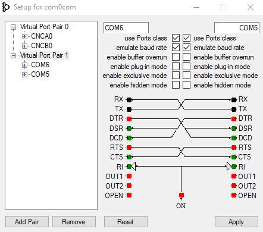

# Serial Device C# Driver

This is a generic C# device driver for RS232 serial device.

## Packages and Software Requirements

* [com0com](http://com0com.sourceforge.net/) (or similar program) to simulate RS232 devices (see picture below for configuration settings)
* `System.IO.Ports` Nuget package
* Microsoft Visual Studio 2019 Community Edition



## Running the solution

1. Open the solution in Microsoft Visual Studio 2019 Community Edition
2. Run the `DeviceSimulation` project without debugging
    * Note: you can set this project to be the default startup project.
3. Once that is up and running, run the unit tests project (`DriverTests`) which will test the driver, which is in the `RS232_Device_Driver` project.

# Simple device protocol

The `DeviceSimulation` project simulates a simple RS232 serial device.

The commands that are sent to the device are of format:

```
commandname <parameter 1> <value 1> <parameter 2> <value 2> ...<CR>
```

The response to a valid command has the following format:

```
<CR><LF>ok [<paramter 1> <value 1> [<paramter 2> <value 2> ...]]<CR><LF>
```

The response to an invalid command could be one of the following:

```
<CR><LF>err "Invalid Value"<CR><LF>
<CR><LF>err "Invalid Parameter"<CR><LF>
<CR><LF>err "Missing Parameter"<CR><LF>
<CR><LF>err<CR><LF>
```


# Resources Used

The resources I used include:

* [com0com](http://com0com.sourceforge.net/)
* System.IO.Ports namespace
* C# [SerialPort Class](https://docs.microsoft.com/en-us/dotnet/api/system.io.ports.serialport?view=dotnet-plat-ext-3.1)